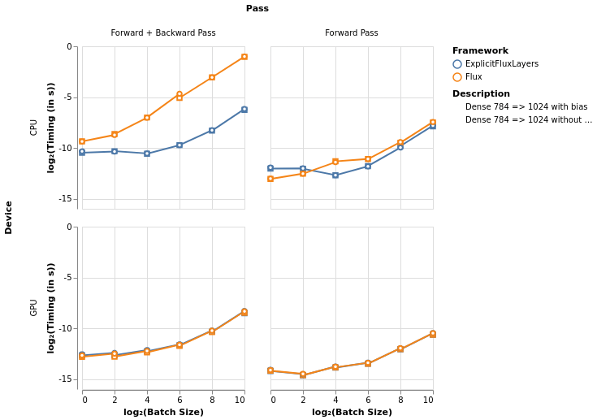

# Explicit Flux Layers Benchmarks

## Plots

### Layer Benchmarks



## RAW Results

### Layer Benchmarks 

```julia
Flux Dense 784 => 1024 with bias
    Forward Pass CPU | Batch Size = 1: 0.000119711s
    Forward Pass + Backward Pass CPU | Batch Size = 1: 0.001512803s
    Forward Pass CPU | Batch Size = 4: 0.000167833s
    Forward Pass + Backward Pass CPU | Batch Size = 4: 0.002359301s
    Forward Pass CPU | Batch Size = 16: 0.000368422s
    Forward Pass + Backward Pass CPU | Batch Size = 16: 0.007630152s
    Forward Pass CPU | Batch Size = 64: 0.000457194s
    Forward Pass + Backward Pass CPU | Batch Size = 64: 0.039179762s
    Forward Pass CPU | Batch Size = 256: 0.001447569s
    Forward Pass + Backward Pass CPU | Batch Size = 256: 0.119925265s
    Forward Pass CPU | Batch Size = 1024: 0.005698222s
    Forward Pass + Backward Pass CPU | Batch Size = 1024: 0.49891819s

    Forward Pass GPU | Batch Size = 1: 5.6084e-5s
    Forward Pass + Backward Pass GPU | Batch Size = 1: 0.000153027s
    Forward Pass GPU | Batch Size = 4: 4.3303e-5s
    Forward Pass + Backward Pass GPU | Batch Size = 4: 0.000172303s
    Forward Pass GPU | Batch Size = 16: 7.0542e-5s
    Forward Pass + Backward Pass GPU | Batch Size = 16: 0.000207643s
    Forward Pass GPU | Batch Size = 64: 9.2053e-5s
    Forward Pass + Backward Pass GPU | Batch Size = 64: 0.000315621s
    Forward Pass GPU | Batch Size = 256: 0.000250038s
    Forward Pass + Backward Pass GPU | Batch Size = 256: 0.000825546s
    Forward Pass GPU | Batch Size = 1024: 0.000695079s
    Forward Pass + Backward Pass GPU | Batch Size = 1024: 0.003088812s

Lux Dense 784 => 1024 with bias
    Forward Pass CPU | Batch Size = 1: 0.000254229s
    Forward Pass + Backward Pass CPU | Batch Size = 1: 0.000771626s
    Forward Pass CPU | Batch Size = 4: 0.000241029s
    Forward Pass + Backward Pass CPU | Batch Size = 4: 0.000758636s
    Forward Pass CPU | Batch Size = 16: 0.00015135s
    Forward Pass + Backward Pass CPU | Batch Size = 16: 0.000667909s
    Forward Pass CPU | Batch Size = 64: 0.000275671s
    Forward Pass + Backward Pass CPU | Batch Size = 64: 0.001174482s
    Forward Pass CPU | Batch Size = 256: 0.000998827s
    Forward Pass + Backward Pass CPU | Batch Size = 256: 0.003258881s
    Forward Pass CPU | Batch Size = 1024: 0.004466608s
    Forward Pass + Backward Pass CPU | Batch Size = 1024: 0.013869519s

    Forward Pass GPU | Batch Size = 1: 5.7062e-5s
    Forward Pass + Backward Pass GPU | Batch Size = 1: 0.000164551s
    Forward Pass GPU | Batch Size = 4: 4.2465e-5s
    Forward Pass + Backward Pass GPU | Batch Size = 4: 0.000180685s
    Forward Pass GPU | Batch Size = 16: 7.1449e-5s
    Forward Pass + Backward Pass GPU | Batch Size = 16: 0.000219936s
    Forward Pass GPU | Batch Size = 64: 9.2961e-5s
    Forward Pass + Backward Pass GPU | Batch Size = 64: 0.000324282s
    Forward Pass GPU | Batch Size = 256: 0.00024913s
    Forward Pass + Backward Pass GPU | Batch Size = 256: 0.000832041s
    Forward Pass GPU | Batch Size = 1024: 0.000698082s
    Forward Pass + Backward Pass GPU | Batch Size = 1024: 0.003161798s

Flux Dense 784 => 1024 without bias
    Forward Pass CPU | Batch Size = 1: 0.000117056s
    Forward Pass + Backward Pass CPU | Batch Size = 1: 0.00151362s
    Forward Pass CPU | Batch Size = 4: 0.000166783s
    Forward Pass + Backward Pass CPU | Batch Size = 4: 0.002496999s
    Forward Pass CPU | Batch Size = 16: 0.000388881s
    Forward Pass + Backward Pass CPU | Batch Size = 16: 0.007758567s
    Forward Pass CPU | Batch Size = 64: 0.000453835s
    Forward Pass + Backward Pass CPU | Batch Size = 64: 0.029482741s
    Forward Pass CPU | Batch Size = 256: 0.001391608s
    Forward Pass + Backward Pass CPU | Batch Size = 256: 0.120302798s
    Forward Pass CPU | Batch Size = 1024: 0.005491775s
    Forward Pass + Backward Pass CPU | Batch Size = 1024: 0.487215173s

    Forward Pass GPU | Batch Size = 1: 5.3569e-5s
    Forward Pass + Backward Pass GPU | Batch Size = 1: 0.000138288s
    Forward Pass GPU | Batch Size = 4: 3.9531e-5s
    Forward Pass + Backward Pass GPU | Batch Size = 4: 0.000140733s
    Forward Pass GPU | Batch Size = 16: 6.7398e-5s
    Forward Pass + Backward Pass GPU | Batch Size = 16: 0.000187597s
    Forward Pass GPU | Batch Size = 64: 8.6395e-5s
    Forward Pass + Backward Pass GPU | Batch Size = 64: 0.000291802s
    Forward Pass GPU | Batch Size = 256: 0.000232925s
    Forward Pass + Backward Pass GPU | Batch Size = 256: 0.000749689s
    Forward Pass GPU | Batch Size = 1024: 0.000624043s
    Forward Pass + Backward Pass GPU | Batch Size = 1024: 0.002782665s

Lux Dense 784 => 1024 without bias
    Forward Pass CPU | Batch Size = 1: 0.000238652s
    Forward Pass + Backward Pass CPU | Batch Size = 1: 0.000697517s
    Forward Pass CPU | Batch Size = 4: 0.000233973s
    Forward Pass + Backward Pass CPU | Batch Size = 4: 0.000777417s
    Forward Pass CPU | Batch Size = 16: 0.000150999s
    Forward Pass + Backward Pass CPU | Batch Size = 16: 0.000654704s
    Forward Pass CPU | Batch Size = 64: 0.000281954s
    Forward Pass + Backward Pass CPU | Batch Size = 64: 0.001177128s
    Forward Pass CPU | Batch Size = 256: 0.001110497s
    Forward Pass + Backward Pass CPU | Batch Size = 256: 0.003156048s
    Forward Pass CPU | Batch Size = 1024: 0.004234559s
    Forward Pass + Backward Pass CPU | Batch Size = 1024: 0.01310688s

    Forward Pass GPU | Batch Size = 1: 5.2521e-5s
    Forward Pass + Backward Pass GPU | Batch Size = 1: 0.000152397s
    Forward Pass GPU | Batch Size = 4: 3.9181e-5s
    Forward Pass + Backward Pass GPU | Batch Size = 4: 0.000154492s
    Forward Pass GPU | Batch Size = 16: 6.621e-5s
    Forward Pass + Backward Pass GPU | Batch Size = 16: 0.000201566s
    Forward Pass GPU | Batch Size = 64: 8.6465e-5s
    Forward Pass + Backward Pass GPU | Batch Size = 64: 0.000305771s
    Forward Pass GPU | Batch Size = 256: 0.00023062s
    Forward Pass + Backward Pass GPU | Batch Size = 256: 0.000766454s
    Forward Pass GPU | Batch Size = 1024: 0.000622718s
    Forward Pass + Backward Pass GPU | Batch Size = 1024: 0.002713599s
```
