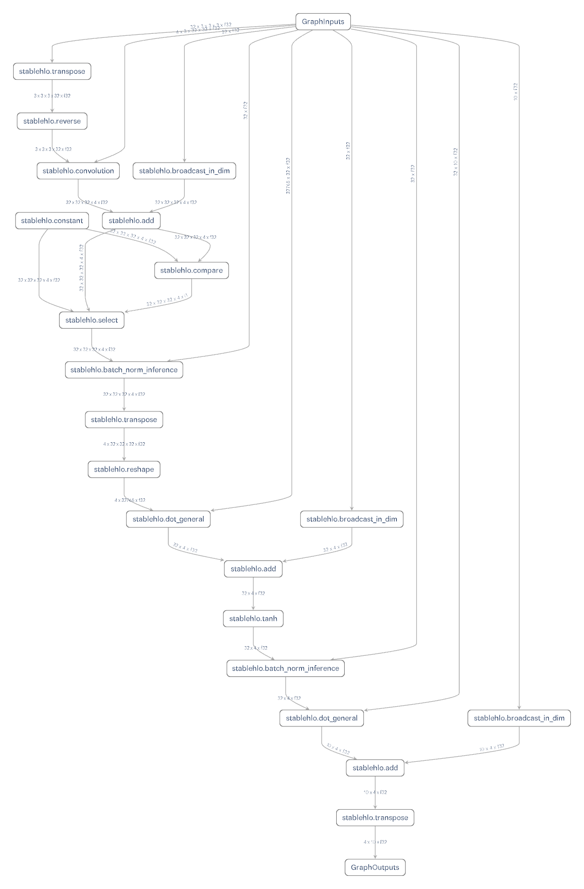
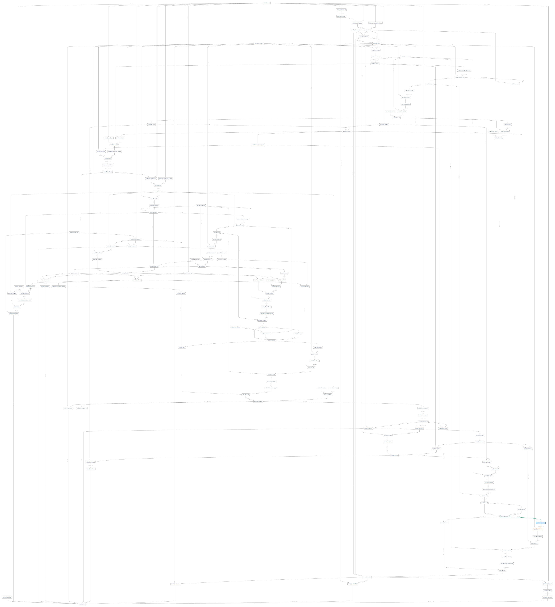

# Visualizing Lux Models using Model Explorer

We can use [model explorer](https://ai.google.dev/edge/model-explorer) to visualize both Lux
models and the corresponding gradient expressions. To do this we just need to compile our
model [using Reactant](@ref reactant-compilation) and save the resulting `mlir` file.

```@example visualize_lux_models
using Lux, Reactant, Enzyme, Random

dev = reactant_device(; force=true)

model = Chain(
    Chain(
        Conv((3, 3), 3 => 32, relu; pad=SamePad()),
        BatchNorm(32),
    ),
    FlattenLayer(),
    Dense(32 * 32 * 32 => 32, tanh),
    BatchNorm(32),
    Dense(32 => 10)
)
ps, st = Lux.setup(Random.default_rng(), model) |> dev

x = randn(Float32, 32, 32, 3, 4) |> dev
nothing #hide
```

Following instructions from [exporting lux models to stablehlo](@ref exporting_to_stablehlo)
we can save the `mlir` file.

```@example visualize_lux_models
hlo = @code_hlo model(x, ps, Lux.testmode(st))

write("exported_lux_model.mlir", string(hlo))
nothing # hide
```



We can also visualize the gradients of the model using the same method.

```@example visualize_lux_models
function ∇sumabs2_enzyme(model, x, ps, st)
    return Enzyme.gradient(Enzyme.Reverse, sum ∘ first ∘ Lux.apply, Const(model),
        x, ps, Const(st))
end

hlo = @code_hlo ∇sumabs2_enzyme(model, x, ps, st)

write("exported_lux_model_gradients.mlir", string(hlo))
nothing # hide
```

This is going to be hard to read, but you get the idea.


