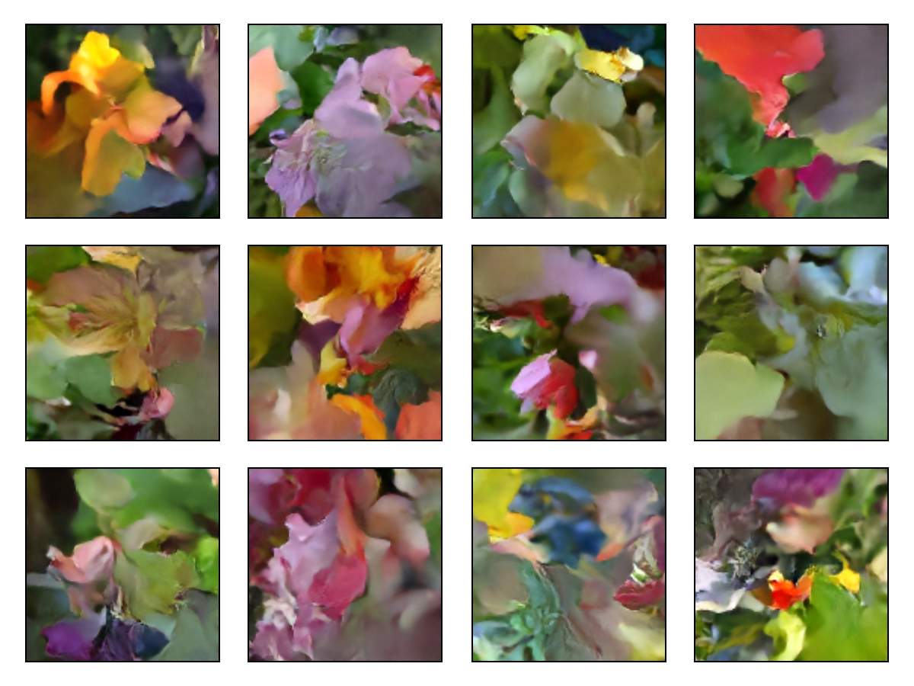

# Denoising Diffusion Implicit Model (DDIM)

[Lux.jl](https://github.com/LuxDL/Lux.jl) implementation of Denoising Diffusion Implicit Models ([arXiv:2010.02502](https://arxiv.org/abs/2010.02502)).

The implementation follows [the Keras example](https://keras.io/examples/generative/ddim/).

The model generates images from Gaussian noises by denoising iteratively.



# Usage

Install Julia and instantiate `Project.toml`.

Following scripts are tested on a single NVIDIA V100 instance with 32GB of GPU memory. You
may need to adjust the batch size and learning rate for your environment.

## Dataset

We use the dataset from [102 Category Flowers Dataset](https://www.robots.ox.ac.uk/~vgg/data/flowers/102/).
The user is prompted to download the dataset when running the code for the first time.
The dataset is cached for subsequent runs.

## Training

```bash
julia --startup-file=no \
    --project=examples/DDIM \
    --threads=auto \
    main.jl \
    --expt-dir output
```

This code runs in about 35 minutes in a single NVIDIA V100 instance with 32GB of GPU
memory. We recommend running the code for atleast 80 epochs to get good results.

## Image generation

```bash
julia --startup-file=no \
    --project=. \
    --threads=auto \
    main.jl \
    --inference-mode \
    --saved-model-path output/checkpoints/model_100.jld2 \
    --generate-n-images 24 \
    --generate-image-seed 12 \
    --expt-dir output
```

## Usage

```bash
usage: main [options] [flags]

Options

  --epochs <100::Int>
  --image-size <128::Int>
  --batchsize <128::Int>
  --learning-rate-start <0.001::Float32>
  --learning-rate-end <0.001::Float32>
  --weight-decay <1.0e-6::Float32>
  --checkpoint-interval <25::Int>
  --expt-dir <tempnam...>
  --diffusion-steps <80::Int>
  --generate-image-interval <5::Int>
  --channels <[32, 64...::Vector{Int}>
  --block-depth <2::Int>
  --min-freq <1.0::Float32>
  --max-freq <1000.0::Float32>
  --embedding-dims <32::Int>
  --min-signal-rate <0.02::Float32>
  --max-signal-rate <0.95::Float32>
  --generate-image-seed <12::Int>
  --saved-model-path <nothing>
  --generate-n-images <10::Int>

Flags

  --inference-mode
  -h, --help                                                Print this help message.
  --version                                                 Print version.
```
